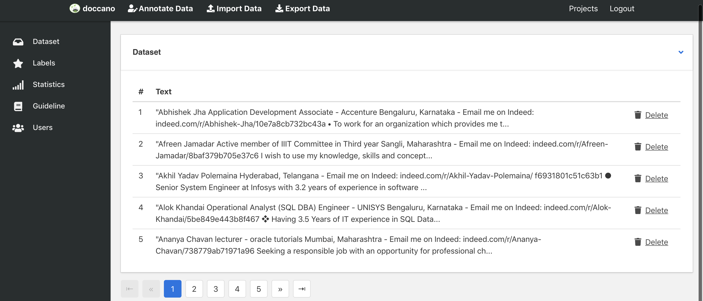
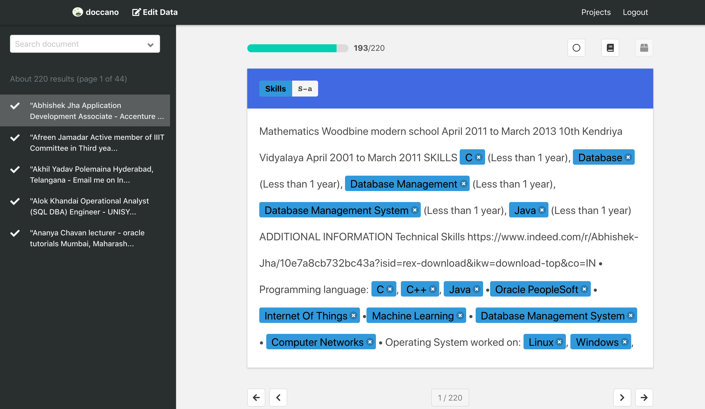

## Learning New Skills from Resume 

## Quick Overview
Usually hiring partners look for candidates with a set of skills. Parsing resumes and extracting information about the individual is a good start but learning new skills from resume is a potential game changer for any hiring organisation since skills keep evolving over time and very often candidates miss out to add skills relevant to their experience. So, automatically learning new skills is a win-win for both candidates and hiring team. 

## Data Preparation
We will now annotate our training data using open source tool [doccano](https://github.com/chakki-works/doccano) since in dataturks annotation we are not aware of what guidelines were given to annotators for labeling and also we observed that they have not just annotated individual skills instead they went ahead and annotated whole line of skills along with punctuations and next line character. We want to avoid those when we annoate our training data.

**Guideline**: Our annotating guideline would be to label individual skills appearing in content of resume anywhere not just in skills section and avoiding punctuations and nextline character.

**Docanno Annotator**

  

**Annotating Data**

  

The keys fields in annotated data are:

* id - serial number given by doccano annotator tool
* text - content of resumes
* meta - no meta
* annotation approver - null in our case
* label - skills which are annotated in each resumes content

## Approach
* Create annotated data using open source tool docanno for skills
* Train spacy Named Entity Recognition for model training
* Label skills in unseen data

## Credits

* [Automatic Summarization of Resumes using Spacy](https://medium.com/@dataturks/automatic-summarization-of-resumes-with-ner-8b97a5f562b)
* [Training NER models using Spacy](https://spacy.io/usage/training#ner)
* [Resume NER Spacy](https://github.com/DataTurks-Engg/Entity-Recognition-In-Resumes-SpaCy)
